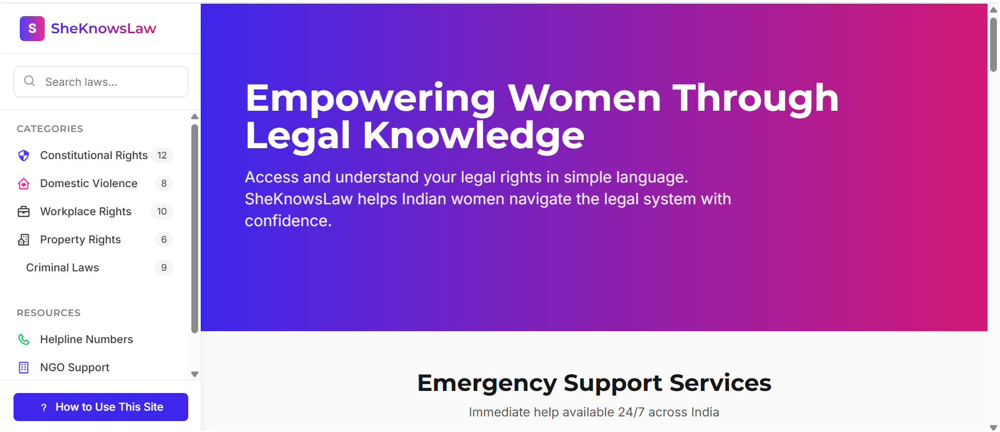
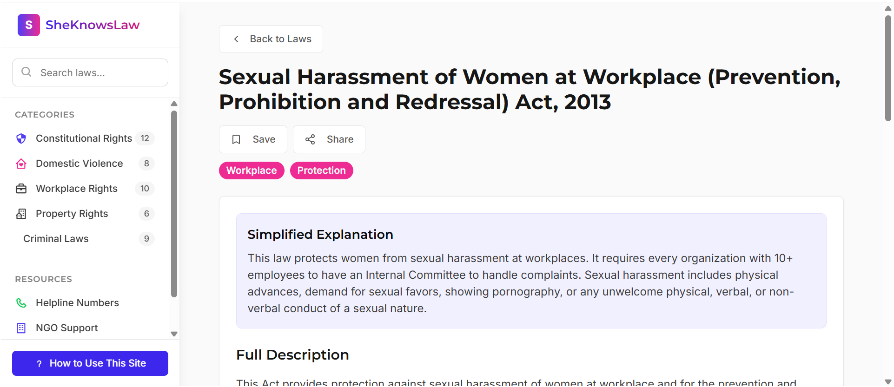
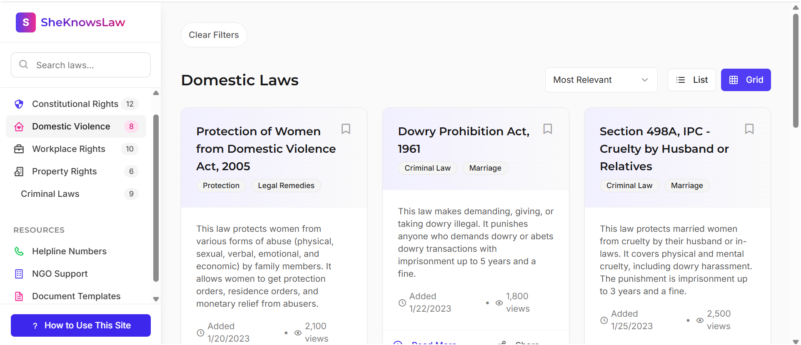

# SheKnowsLaw - Women's Legal Resource Platform

## About the Project

SheKnowsLaw is a comprehensive legal resource platform dedicated to empowering women across India by making legal information accessible, understandable, and actionable. Our platform breaks down complex legal jargon into simple language that anyone can understand.

## Features

### 1. Law Categories
- Constitutional Rights
- Domestic Violence Laws
- Workplace Rights
- Property Laws
- Criminal Laws

### 2. User-Friendly Interface
- Simplified law explanations
- Easy navigation by categories
- Search functionality
- Related laws suggestions
- Save and share features

### 3. Resource Center
- Emergency helplines (24/7 support)
- NGO support contacts
- Document templates
- Legal aid resources

### 4. Key Features
- Mobile-responsive design
- Simplified legal explanations
- Comprehensive law database
- Related laws suggestions
- Resource directory

## Screenshots

### Home Page

*Landing page with category navigation and featured laws*

### Law Detail Page

*Detailed view of legal information with simplified explanations*

### Resources Page

*Access to helplines, NGO contacts, and legal resources*

## Tech Stack

### Frontend
- React.js with TypeScript
- Tailwind CSS for styling
- Lucide React for icons
- Shadcn UI components
 

## Installation Guide

1. **Clone the Repository**
   ```bash
   git clone https://github.com/Mahesh-Langote/she-knows-law.git
   cd she-knows-law
   ```

2. **Install Dependencies**
   ```bash
   # Install frontend dependencies
   cd client
   npm install

   # Install backend dependencies
   cd ../server
   npm install
   ```
 
## Contributing

We welcome contributions to improve SheKnowsLaw! Please follow these steps:

1. Fork the repository
2. Create your feature branch (`git checkout -b feature/AmazingFeature`)
3. Commit your changes (`git commit -m 'Add some AmazingFeature'`)
4. Push to the branch (`git push origin feature/AmazingFeature`)
5. Open a Pull Request

## License

This project is licensed under the MIT License - see the [LICENSE](LICENSE) file for details.

## Contact

Email: contact@sheknowslaw.org

## Acknowledgments

- National Commission for Women
- National Legal Services Authority
- All contributing NGOs and legal professionals