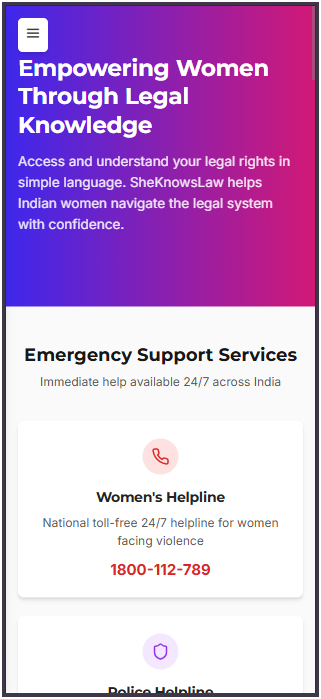
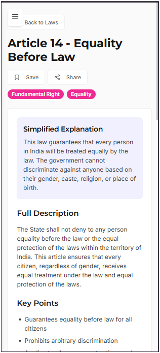

 
---

# **SheKnowsLaw - Women’s Legal Resource Platform**

## 📖 About the Project

**SheKnowsLaw** is a comprehensive legal resource platform built to **empower women across India** by making legal information **accessible, understandable, and actionable**. The platform breaks down complex legal jargon into plain, everyday language, ensuring that every woman, regardless of her background, has the knowledge to assert her rights.

---

## ✨ Features

### 📚 Law Categories
- **Constitutional Rights**
- **Domestic Violence Laws**
- **Workplace Rights**
- **Property Laws**
- **Criminal Laws**

### 🧭 User-Friendly Interface
- Simplified legal explanations
- Easy navigation by category
- Built-in search functionality
- Smart suggestions for related laws
- Save and share features

### 🛟 Resource Center
- 24/7 **emergency helplines**
- NGO support contact list
- Downloadable **document templates**
- Access to **legal aid** and assistance

### 📱 Mobile Responsiveness
- Fully mobile-responsive design
- Optimized UI for smaller screens
- Touch-friendly navigation and controls

---

## 🖼️ Screenshots

### 💻 Desktop Views

#### Home Page  
  
*Landing page with category navigation and featured laws*

#### Law Detail Page  
  
*In-depth legal information with simplified explanations*

#### Resources Page  
  
*Access to helplines, NGO contacts, and essential legal support*

### 📱 Mobile Views (Responsive Design)

#### Mobile Home Page  
  
*Responsive layout adapted for mobile screens*

#### Mobile Law Detail Page  
   
---

## 🛠️ Tech Stack

### Frontend
- **React.js** with **TypeScript**
- **Tailwind CSS** for rapid styling
- **Lucide React** for modern icons
- **Shadcn UI** for reusable components

---

## 🚀 Getting Started

### Prerequisites
- Node.js and npm installed

### Installation & Running Locally

1. **Clone the Repository**
   ```bash
   git clone https://github.com/Mahesh-Langote/she-knows-law.git
   cd she-knows-law
   ```

2. **Install Dependencies**
   ```bash
   # Frontend
   cd client
   npm install

   # Backend
   cd ../server
   npm install
   ```

3. **Run the Development Server**
   ```bash
   # From the client directory
   npm run dev
   ```

4. **Build for Production**
   ```bash
   npm run build
   ```

---

## 🤝 Contributing

We love community contributions! Here's how you can help:

1. Fork the repo
2. Create your feature branch:  
   `git checkout -b feature/AmazingFeature`
3. Commit your changes:  
   `git commit -m 'Add some AmazingFeature'`
4. Push to the branch:  
   `git push origin feature/AmazingFeature`
5. Open a Pull Request and describe your changes

---

## 📄 License

This project is licensed under the **MIT License**. See the [LICENSE](LICENSE) file for details.

---

## 📬 Contact

**Email:** maheshlangote779@gmail.com

---

## 🙏 Acknowledgments

- National Commission for Women
- National Legal Services Authority
- Contributing NGOs, legal experts & volunteers

---
 